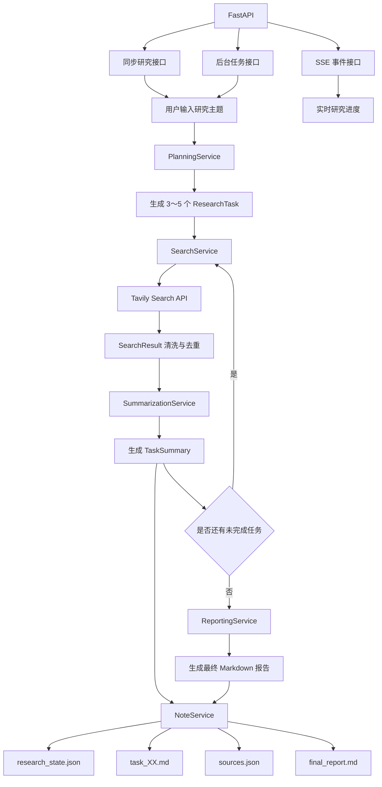

# Chapter 14：自动化深度研究智能体

本项目实现了一个简化版 Deep Research Agent。

用户输入一个研究主题后，系统会自动完成：

1. 研究任务规划；
2. 网络资料搜索；
3. 搜索结果清洗与去重；
4. 子任务总结；
5. 中间研究笔记保存；
6. 最终研究报告生成；
7. 后台任务状态管理；
8. SSE 实时进度推送；
9. 端到端质量评估。

---

## 一、项目架构



---

## 二、核心工作流程

```text
研究主题
   ↓
PlanningService
   ↓
3～5 个研究子任务
   ↓
逐个执行：
   ├── SearchService
   ├── URL 去重
   ├── 摘要截断
   ├── SummarizationService
   └── NoteService
   ↓
ReportingService
   ↓
最终 Markdown 报告
```

---

## 三、目录结构

```text
chapter14/
├── backend/
│   ├── __init__.py
│   ├── agent.py
│   ├── api_models.py
│   ├── dependencies.py
│   ├── main.py
│   ├── models.py
│   ├── prompts.py
│   ├── task_manager.py
│   │
│   ├── services/
│   │   ├── __init__.py
│   │   ├── note_service.py
│   │   ├── planning_service.py
│   │   ├── reporting_service.py
│   │   ├── search_service.py
│   │   └── summarization_service.py
│   │
│   └── utils/
│       ├── __init__.py
│       ├── json_parser.py
│       └── source_utils.py
│
├── evaluation/
│   ├── __init__.py
│   ├── evaluate_deep_research.py
│   ├── test_cases.json
│   └── results/
│       └── .gitkeep
│
├── examples/
│   ├── __init__.py
│   ├── full_research_demo.py
│   ├── json_parser_demo.py
│   ├── models_demo.py
│   ├── note_service_demo.py
│   ├── planning_service_demo.py
│   ├── reporting_service_demo.py
│   ├── search_service_demo.py
│   ├── sse_client_demo.py
│   └── summarization_service_demo.py
│
├── tests/
│   ├── __init__.py
│   ├── test_agent.py
│   ├── test_background_api.py
│   ├── test_json_parser.py
│   ├── test_main.py
│   ├── test_models.py
│   ├── test_note_service.py
│   ├── test_planning_service.py
│   ├── test_reporting_service.py
│   ├── test_search_service.py
│   ├── test_source_utils.py
│   ├── test_sse_api.py
│   └── test_summarization_service.py
│
├── workspace/
│   ├── notes/
│   │   └── .gitkeep
│   └── reports/
│       └── .gitkeep
│
├── .env.example
├── README.md
└── requirements.txt
```

---

## 四、核心模块

### 1. PlanningService

负责将复杂研究主题拆分为 3～5 个子任务。

每个子任务包含：

```json
{
  "title": "研究任务标题",
  "intent": "该任务希望解决的问题",
  "query": "可以直接用于搜索的检索语句"
}
```

### 2. SearchService

负责调用 Tavily Search API，并将原始搜索结果转换为统一的 `SearchResult`。

主要功能：

- 搜索关键词校验；
- HTTP 异常处理；
- URL 标准化；
- 重复来源去除；
- 摘要长度限制；
- 无效搜索结果过滤。

### 3. SummarizationService

负责根据一个 `ResearchTask` 及其搜索结果生成子任务总结。

总结内容包括：

- 核心结论；
- 详细分析；
- 来源编号；
- 资料局限性。

### 4. NoteService

负责保存研究过程中的中间结果。

每次研究会生成：

```text
research_state.json
task_01.md
task_02.md
sources.json
final_report.md
```

### 5. ReportingService

负责整合多个 `TaskSummary`，生成最终 Markdown 研究报告。

报告包含：

- 摘要；
- 研究背景；
- 主要发现；
- 综合分析；
- 局限性；
- 结论；
- 参考资料。

### 6. DeepResearchAgent

负责协调所有服务：

```text
PlanningService
    ↓
SearchService
    ↓
SummarizationService
    ↓
NoteService
    ↓
ReportingService
```

Agent 本身主要负责流程编排、状态管理和事件发送，不直接实现搜索或模型调用。

### 7. ResearchJobStore

负责保存后台研究任务的运行状态和事件历史。

支持：

- 创建后台任务；
- 查询任务状态；
- 更新研究进度；
- 保存 SSE 事件；
- 根据事件序号恢复事件流。

---

## 五、安装依赖

在仓库根目录运行：

```powershell
pip install -r chapter14\requirements.txt
```

---

## 六、环境变量

复制或参考：

```text
chapter14/.env.example
```

在仓库根目录的 `.env` 中配置：

```env
LLM_MODEL_ID=你的模型名称
LLM_API_KEY=你的模型API密钥
LLM_BASE_URL=你的模型接口地址
LLM_TIMEOUT=60

TAVILY_API_KEY=你的Tavily密钥
```

实际变量名称应与当前 `HelloAgentsLLM` 的配置方式保持一致。

不要将真实 `.env` 文件提交到 Git。

---

## 七、运行自动化测试

运行 Chapter 14 的全部测试：

```powershell
python -m pytest chapter14\tests -v
```

测试覆盖：

- Pydantic 数据模型；
- JSON 数组解析；
- 研究计划生成；
- 搜索结果清洗；
- 子任务总结；
- 笔记持久化；
- 最终报告生成；
- Agent 完整工作流；
- FastAPI 同步接口；
- 后台任务接口；
- SSE 事件接口；
- 失败状态处理。

---

## 八、运行命令行完整研究

```powershell
python -m chapter14.examples.full_research_demo
```

该程序会真实执行：

```text
1 次研究规划模型调用
3～5 次 Tavily 搜索
3～5 次子任务总结模型调用
1 次最终报告模型调用
```

研究结果保存在：

```text
chapter14/workspace/notes/
chapter14/workspace/reports/
```

---

## 九、启动 FastAPI

```powershell
python -m uvicorn chapter14.backend.main:app --reload --port 8000
```

启动成功后可以访问：

```text
健康检查：
http://127.0.0.1:8000/health

Swagger 文档：
http://127.0.0.1:8000/docs
```

---

## 十、API 接口

### 1. 同步研究接口

```http
POST /research
```

请求：

```json
{
  "topic": "MCP 协议对智能体开发有什么价值？"
}
```

该接口会等待整个研究任务执行完成后返回。

### 2. 创建后台研究任务

```http
POST /research/tasks
```

请求：

```json
{
  "topic": "MCP 协议对智能体开发有什么价值？"
}
```

响应：

```json
{
  "job_id": "任务编号",
  "status": "queued",
  "status_url": "/research/tasks/任务编号"
}
```

### 3. 查询后台研究任务

```http
GET /research/tasks/{job_id}
```

可以查询：

- 当前状态；
- 当前阶段；
- 进度百分比；
- 子任务数量；
- 已完成任务数量；
- 最终报告；
- 报告文件路径；
- 错误信息。

### 4. 订阅 SSE 研究事件

```http
GET /research/tasks/{job_id}/events
```

支持的事件包括：

```text
job_queued
job_started
planning_started
planning_completed
task_started
search_started
search_completed
summarization_started
task_completed
reporting_started
research_completed
job_completed
research_failed
job_failed
```

---

## 十一、运行 SSE 客户端

先启动 FastAPI：

```powershell
python -m uvicorn chapter14.backend.main:app --reload --port 8000
```

再打开另一个终端：

```powershell
python -m chapter14.examples.sse_client_demo
```

客户端会创建后台研究任务并实时打印 Agent 事件。

---

## 十二、运行端到端评估

运行指定评估用例：

```powershell
python -m chapter14.evaluation.evaluate_deep_research --case-id mcp_value
```

运行全部评估用例：

```powershell
python -m chapter14.evaluation.evaluate_deep_research --all
```

评估内容包括：

- 工作流是否完成；
- 子任务数量是否合理；
- 所有子任务是否完成；
- 每个任务是否生成总结；
- 来源数量是否充足；
- 报告章节是否完整；
- 报告是否包含引用；
- 预期关键词是否出现；
- 报告是否成功保存。

当前通过标准：

```text
总分不低于 80 分
```

---

## 十三、项目特点

本项目实现了以下 Agent 工程能力：

- 基于大模型的任务规划；
- 结构化模型输出解析；
- 真实网络搜索；
- 搜索结果清洗和去重；
- 多阶段大模型调用；
- 中间研究状态持久化；
- 多服务工作流编排；
- FastAPI 接口封装；
- 后台任务管理；
- SSE 实时事件推送；
- Fake Service 单元测试；
- 端到端质量评估。

---

## 十四、已知局限

### 1. 后台任务只保存在内存中

`ResearchJobStore` 使用 Python 字典保存任务状态。

因此：

- FastAPI 重启后任务查询记录会丢失；
- 不支持多个 Uvicorn Worker 共享任务状态；
- 不适合直接用于生产环境。

生产环境可以替换为：

- Redis；
- PostgreSQL；
- Celery；
- 专门的任务队列。

### 2. 研究任务按顺序执行

当前子任务依次完成：

```text
搜索任务 1
总结任务 1
搜索任务 2
总结任务 2
```

尚未实现并发搜索或并行总结。

### 3. 搜索来源质量依赖搜索服务

当前系统主要根据搜索结果摘要生成总结，没有进一步抓取并解析完整网页正文。

因此可能出现：

- 摘要信息不完整；
- 来源质量不稳定；
- 关键上下文缺失。

### 4. 引用编号主要依赖模型遵守提示词

系统会在提示词中提供来源编号映射，但尚未实现严格的引用一致性自动修复。

### 5. 没有实现研究反思循环

当前流程为线性流程：

```text
规划 → 搜索 → 总结 → 报告
```

尚未根据资料不足情况自动生成新查询并继续搜索。

---

## 十五、后续改进方向

可以在后续毕业设计中增加：

1. 搜索结果网页正文抓取；
2. 并发子任务执行；
3. 查询扩展和搜索重试；
4. 研究反思与补充检索；
5. Redis 任务状态持久化；
6. 用户登录和研究历史管理；
7. Vue 前端进度展示；
8. 报告导出为 PDF；
9. 更严格的引用一致性检查；
10. Agent 运行成本和 Token 统计。

---

## 十六、当前完成状态

- [x] 数据模型
- [x] JSON 解析
- [x] 研究规划服务
- [x] 搜索服务
- [x] 子任务总结服务
- [x] 研究笔记持久化
- [x] 最终报告服务
- [x] Deep Research Agent 工作流
- [x] 自动化测试
- [x] FastAPI 同步接口
- [x] 后台任务管理
- [x] 状态查询接口
- [x] SSE 实时事件接口
- [x] 端到端评估
- [x] 项目说明文档